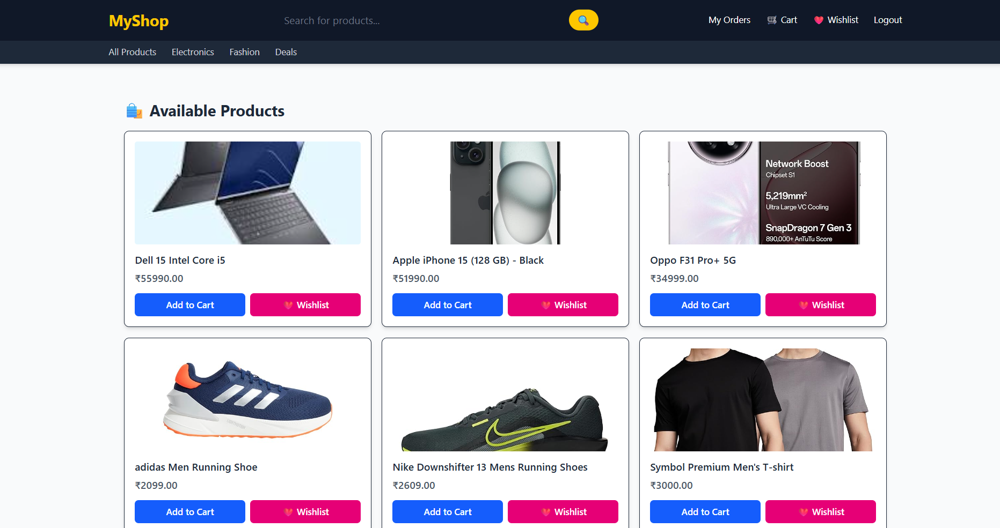
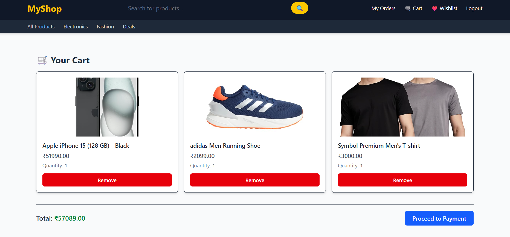
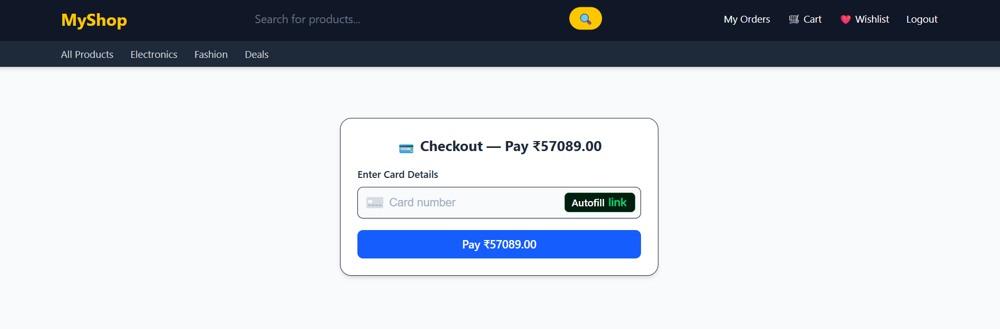
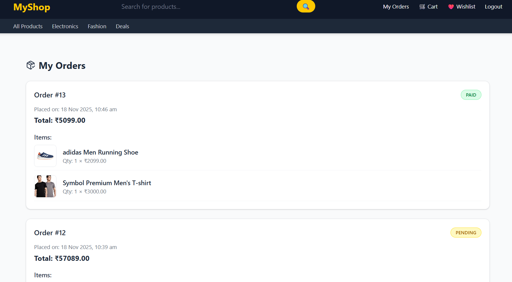
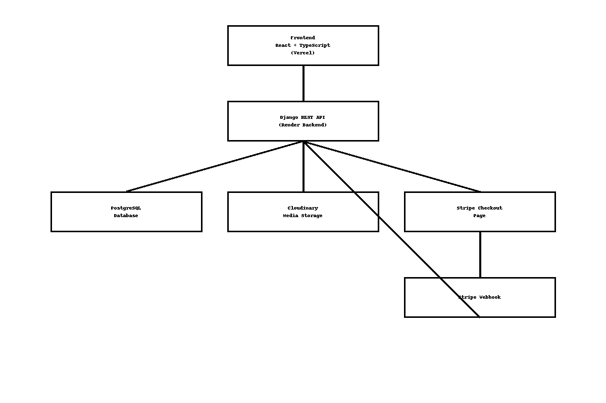
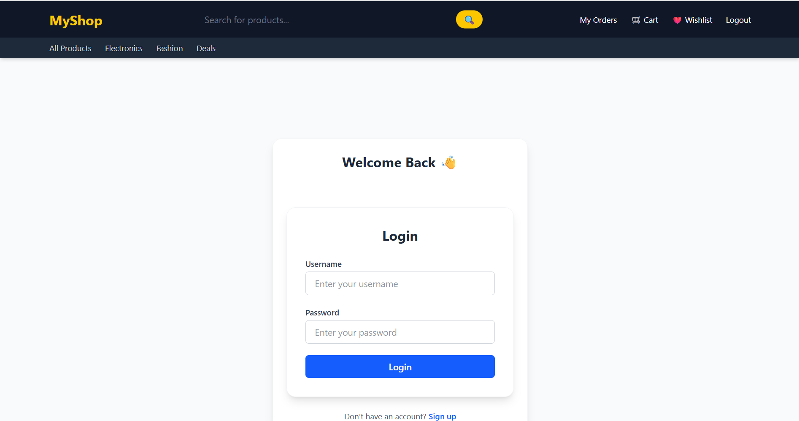
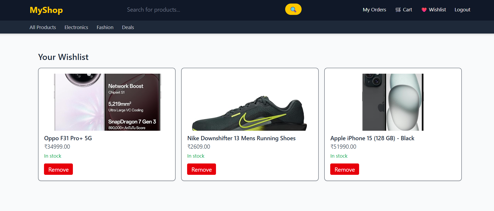
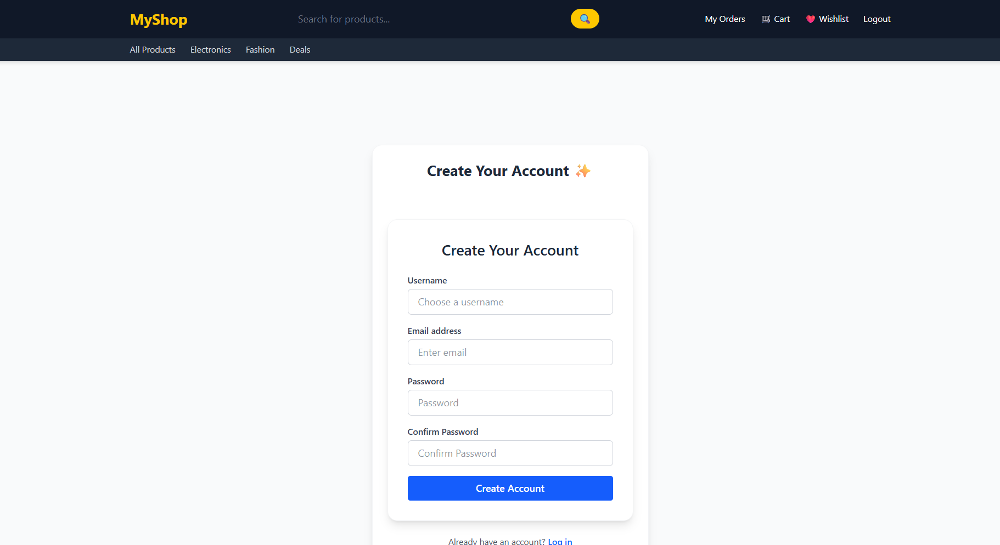
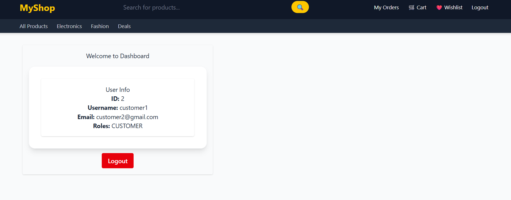

<p align="center">
  <!-- Tech Stack -->
  
  
  
  
  
  
  
  

  <!-- Deployment Status -->
  
  

  <!-- License -->
  
</p>


# 🛍️ Full-Stack E-Commerce Platform  
**Django REST Framework + React + TypeScript + PostgreSQL + Cloudinary + Stripe**

A complete **production-grade e-commerce system** built using modern technologies and deployed on **Render + Vercel**.  
Designed for **freelancing**, **portfolio showcase**, and **real-world commercial use**.

---
## 🌟 Project Preview

<div align="center">

### 🖼️ Modern & Clean UI — Built for Freelancing & Real Clients

<table>
<tr>
<td align="center"><br/><b>Product Catalog</b></td>
<td align="center"><br/><b>User Cart</b></td>
</tr>
<tr>
<td align="center"><br/><b>Stripe Checkout</b></td>
<td align="center"><br/><b>Order History</b></td>
</tr>
</table>

</div>

---
## 🌍 Live Demo Links

| Service | URL |
|--------|------|
| 🖥️ Frontend | **https://ecommerce-frontend-rs.vercel.app** |
| ⚙️ Backend API | **https://ecommerce-backend-44e1.onrender.com** |
| 📘 Swagger Docs | **https://ecommerce-backend-44e1.onrender.com/api/schema/swagger-ui/** |
| ☁️ Cloudinary Media | https://cloudinary.com |

---

## 🧩 Project Highlights

✔ Fully functional **E-commerce workflow**  
✔ Authentication (Signup / Login / JWT Refresh)  
✔ Product Catalog + Search + Pagination  
✔ Wishlist & Cart (per user)  
✔ Checkout + Stripe Payment  
✔ Order creation + Webhook-based **Paid** status update  
✔ Cloudinary-based media storage  
✔ Fully deployed on **Vercel + Render**  
✔ Clean folder structure + professional documentation  

---

## 🧠 Tech Stack

### **Backend**
- Django 5  
- Django REST Framework  
- PostgreSQL  
- SimpleJWT  
- Cloudinary Storage  
- Stripe Payments  
- drf-spectacular (Swagger)

### **Frontend**
- React 18  
- TypeScript  
- Vite  
- Bootstrap 5  
- Tailwind CSS  
- Axios  
- React Router v6  

### **Deployment**
- Render (Backend)  
- Vercel (Frontend)  
- Cloudinary (Media)

---

## 📦 Folder Structure

```
ecommerce-fullstack-app/
│
├── backend/                 # Django REST API
│   ├── apps/                # users, catalog, cart, orders, payments
│   ├── config/              # settings, urls, wsgi
│   ├── core/                # middleware, utils, logger
│   └── README.md
│
├── frontend/                # React + TypeScript app
│   ├── src/
│   ├── components/
│   ├── pages/
│   ├── services/
│   └── README.md
│
└── docs/
    └── screenshots/
        ├── home.png
        ├── product-list.png
        ├── product-detail.png
        ├── cart.png
        ├── wishlist.png
        ├── checkout.png
        ├── order-success.png
        ├── admin-upload.png
        └── swagger.png
```

---

## 🧩 Architecture Diagram

### 🌙 Light Theme:



```
React + TypeScript (Vercel)
        |
        | REST API Calls (Axios)
        v
Django REST API (Render)
        |
        | ORM Queries
        v
PostgreSQL (Render DB)
        |
        | Media Uploads
        v
Cloudinary Storage
        |
        | Payment Events
        v
Stripe Checkout + Webhooks
```

---

## 🔐 Authentication Flow (JWT)

- User Signup → `/api/auth/signup/`  
- Login → `/api/auth/token/`  
- Refresh Token → `/api/auth/token/refresh/`  
- `axios interceptor` handles token refresh automatically.

---

## 🛒 Core Features

### 🛍️ **Product Module**
- Cloudinary image upload  
- Search + Pagination  
- Admin CRUD functionality  

### 🛒 **Cart / Wishlist**
- Per-user storage  
- Add / Remove / Update quantities  

### 💳 **Checkout + Payments**
- Stripe Checkout (test mode)  
- Webhook → updates order to **PAID**  
- Complete order history  

### 🧾 **Logging**
- Backend Request logger  
- Frontend error logger (optional)

---

## ⚙️ Run Locally (Backend)

```bash
cd backend
python -m venv venv
venv\Scriptsctivate
pip install -r requirements.txt
python manage.py migrate
python manage.py runserver
```

---

## ⚙️ Run Locally (Frontend)

```bash
cd frontend
npm install
npm run dev
```

---

## 🔧 Environment Variables

### **Backend (`.env`)**
```
DEBUG=True
DATABASE_URL=postgres://...
CLOUDINARY_CLOUD_NAME=...
CLOUDINARY_API_KEY=...
CLOUDINARY_API_SECRET=...
STRIPE_SECRET_KEY=...
STRIPE_WEBHOOK_SECRET=...
ALLOWED_HOSTS=localhost,127.0.0.1
CORS_ALLOWED_ORIGINS=http://localhost:5173
```

### **Frontend (`.env`)**
```
VITE_API_BASE_URL=https://ecommerce-backend-44e1.onrender.com
VITE_STRIPE_PUBLISHABLE_KEY=pk_test_xxxxx
```

---

## 📸 Screenshots

### 🏠 Login


### 🛍️ Product List


### 🛒 Cart


### ❤️ Wishlist


### 💳 Checkout


### 📝 Register


### 📦 My Orders


### 👤 Profile



---

```md
## 🧩 Git Workflow (Professional Branching Model)

```mermaid
flowchart LR
    A[staging branch<br/>Daily development] -->|Merge when stable| B[main branch<br/>Production-ready]
    B -->|Auto Deploy| C[Vercel Frontend]
    B -->|Auto Deploy| D[Render Backend]
    A --> E[feature branches optional]


## 👨‍💻 Author  
**Ranjeet Singh**  
Full-Stack Developer (Django REST + React + TypeScript)  
🔗 LinkedIn | 🔗 GitHub

---

## 🪄 License  
MIT License — free to use for learning, freelancing, or commercial projects.
